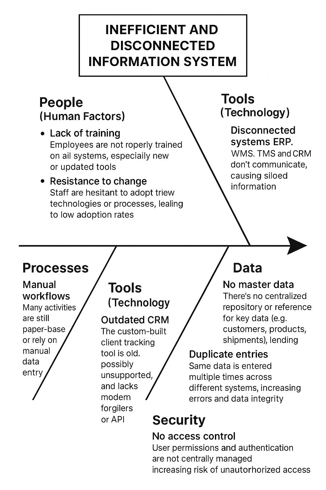

---

1. 🧑 **Personnes (Facteurs humains)**

   * Manque de formation : Les employés ne sont pas correctement formés à tous les systèmes, surtout aux outils nouveaux ou mis à jour.
   * Résistance au changement : Le personnel hésite à adopter de nouvelles technologies ou processus, ce qui entraîne un faible taux d’adoption.

2. ⚙️ **Processus**

   * Flux de travail manuels : De nombreuses activités sont encore basées sur du papier ou reposent sur la saisie manuelle des données, augmentant le risque d’erreurs et ralentissant les opérations.
   * Absence d’automatisation : Peu ou pas d’outils ou scripts automatisés pour simplifier les tâches répétitives.

3. 🛠️ **Outils (Technologie)**

   * Systèmes déconnectés : ERP, WMS, TMS et CRM ne communiquent pas, ce qui crée des silos d’information.
   * CRM obsolète : L’outil personnalisé de suivi client est ancien, probablement non supporté, et manque de fonctionnalités modernes ou de support API.

4. 🧾 **Données**

   * Pas de données de référence (Master Data) : Il n’existe pas de référentiel centralisé pour les données clés (clients, produits, expéditions), ce qui cause des incohérences.
   * Entrées en double : Les mêmes données sont saisies plusieurs fois dans différents systèmes, augmentant les erreurs et problèmes d’intégrité des données.

5. 🔐 **Sécurité**

   * Pas de contrôle d’accès : Les permissions utilisateurs et l’authentification ne sont pas gérées de manière centralisée, augmentant le risque d’accès non autorisé.
   * Risque de fuite de données : À cause de la faible intégration et des logiciels obsolètes, les informations sensibles peuvent être exposées ou perdues.

---

