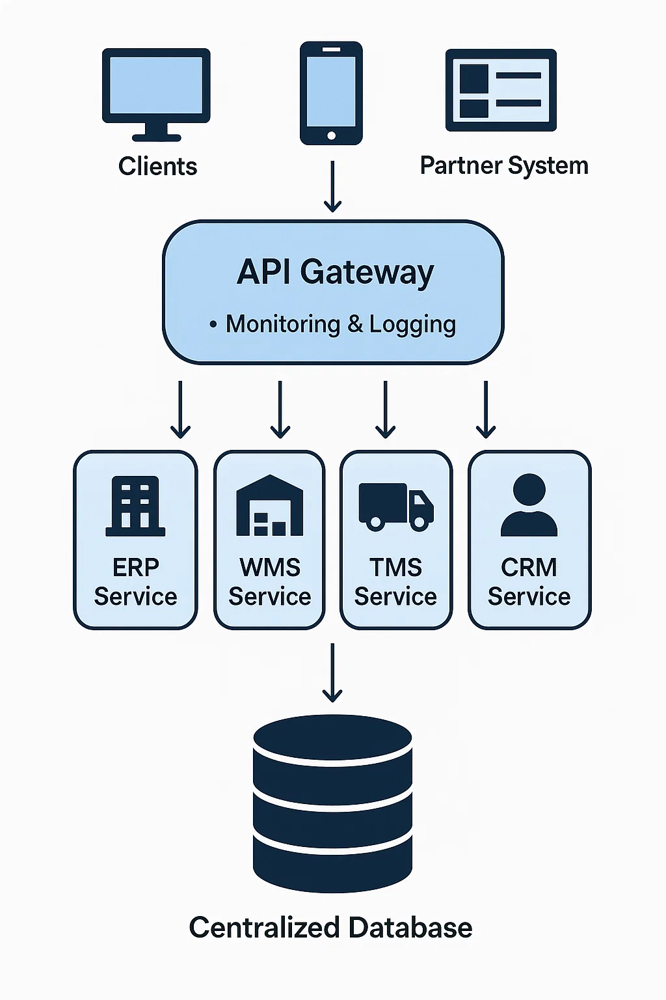
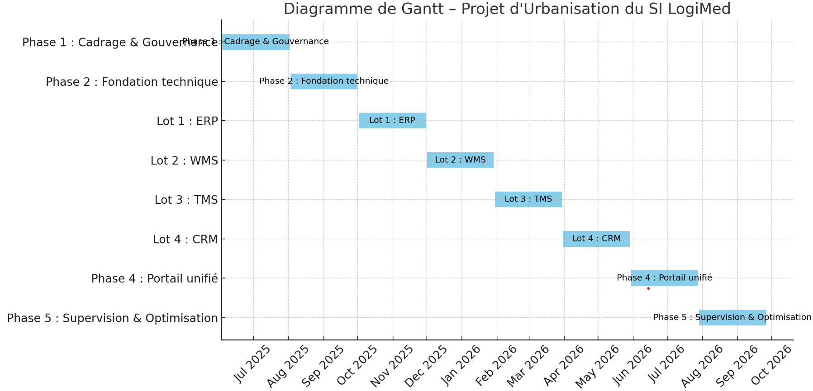

---

# 📏 Architecture cible du Système d'Information de LogiMed (TO-BE)

---

## 1. 📊 Composants architecturaux principaux

### a. ✨ Architecture orientée services (SOA)

* **Services** par domaine fonctionnel :

  * **Service ERP** : finance, facturation, comptabilité.
  * **Service WMS** : gestion d'entrepôt, gestion des stocks.
  * **Service TMS** : transport, planification, suivi des livraisons.
  * **Service CRM** : gestion client, support, données clients.
* Les services exposent leurs fonctionnalités via des **API RESTful ou SOAP**.
* Architecture **faiblement couplée** : les services communiquent via des contrats d'API uniquement.
* Chaque service peut être développé, déployé et évolué de manière indépendante.

### b. 🛡️ API Gateway

* Sert de **point d'entrée unique** pour toutes les requêtes.
* Fonctions principales :

  * **Authentification & Autorisation** (OAuth2, JWT).
  * **Routage des requêtes** vers les services backend.
  * **Limitation de charge (rate limiting)**.
  * **Agrégation d'API**.
  * **Supervision & journalisation** des appels.

### c. 📂 Base de données centralisée

* Une seule base stocke les données maîtres partagées :

  * Clients
  * Produits
  * Expéditions
  * Transactions financières
* Assure la **cohérence des données**.
* Accès contrôlé via des couches de service sécurisées.

---

## 2. → Flux de données et intégration

* Les applications clientes (web, mobile, partenaires) accèdent aux services via l'**API Gateway**.
* La Gateway authentifie et redirige les appels vers les bons services.
* Communication inter-services possible :

  * Le TMS interroge le WMS pour vérifier les stocks.
  * L'ERP consulte les frais de transport du TMS.
* Communication **asynchrone (messagerie)** ou **API directe**.
* La base centralisée est le **référentiel unique** pour les services.
* Les systèmes externes peuvent être exposés via des connecteurs ou adaptateurs.

---

## 3. 🔒 Sécurité et gouvernance

* Authentification centralisée via API Gateway.
* **RBAC** (contrôle d'accès basé sur les rôles).
* Chiffrement des données en transit (TLS) et au repos.
* Logs d'audit pour la conformité.
* La Gateway applique les politiques de sécurité : restrictions IP, quotas, etc.

---

## 4. ⚡️ Scalabilité et fiabilité

* Les services peuvent être **mis à l'échelle individuellement**.
* L'API Gateway répartit la charge (load balancing).
* La base de données peut être répliquée et sauvegardée.
* Outils de supervision pour surveiller performance et disponibilité.

---

# 🗐️ Plan d’urbanisation du SI – LogiMed

---

## 🧩 Phase 1 : Cadrage & Gouvernance

* Analyse des outils actuels (ERP, WMS, TMS, CRM)
* Identification des redondances et problèmes métiers
* Définition de la **cartographie cible**
* Mise en place d'un **comité de pilotage SI**
* Choix technologiques : API Gateway, base centralisée, outils de supervision

🕒 Durée estimée : 1 à 2 mois

---

## 🛠️ Phase 2 : Fondation technique

* Mise en place de l'**API Gateway**
* Mise en place d'un **socle de sécurité** : auth, RBAC, logs
* Déploiement d'une **base de données centralisée**
* Mise en place de REST ou d'un **bus de communication**

🕒 Durée estimée : 2 mois

---

## 🔄 Phase 3 : Urbanisation des services métiers

**Approche par lots fonctionnels priorisés** :

### 📊 Lot 1 : ERP

* Exposition via API des fonctions financières
* Migration des données vers la base centrale
* Connexion à la Gateway

### 📦 Lot 2 : WMS

* API de gestion de stock
* Connexion au TMS et CRM
* Synchronisation de données

### 🚛 Lot 3 : TMS

* API de suivi et transport
* Intégration avec ERP et WMS

### 🧑‍🤝‍🧑 Lot 4 : CRM

* Refonte ou encapsulation des fonctions client
* Connexion avec ERP et TMS

🕒 Durée estimée par lot : 2 à 3 mois

---

## 📱 Phase 4 : Portail unifié et interfaces modernes

* Portail web centralisé pour les utilisateurs internes et partenaires
* Accès unifié via l'API Gateway (authentification unique)
* Interfaces mobiles si besoin

---

## 🔍 Phase 5 : Supervision & Optimisation

* Dashboards pour la supervision API (trafic, erreurs, latence)
* Tests de charge et sécurité
* Optimisation des flux inter-services
* Mise en place d'une gouvernance API durable

---

## ✅ Livrables attendus

* Documentation de l’architecture cible
* API Gateway fonctionnelle
* Catalogue unifié d’APIs
* Données consolidées
* Services interconnectés et sécurisés
* Portail web opérationnel

---
